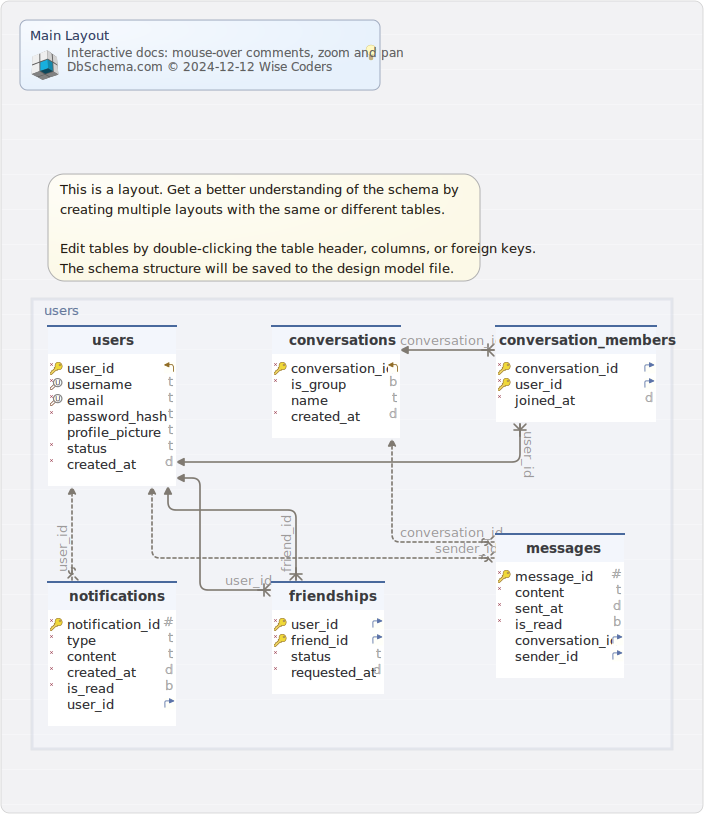

# Chat Application Backend

A real-time chat application backend built with NestJS, PostgreSQL, TypeORM, and WebSocket.

## Features

### 1. Authentication System

- User registration with email validation
- Secure password hashing using bcrypt
- JWT-based authentication
- User status tracking (online/offline)
- Protected routes using Guards

### 2. Friend Management System

The friend management system provides comprehensive functionality for managing user relationships, including friend requests, blocking, and friend suggestions.

#### Friend Request Endpoints

```http
# Send Friend Request
POST /friendships/request
Authorization: Bearer <jwt_token>
{
  "friendId": "number"
}

# Accept Friend Request
POST /friendships/accept/:friendId
Authorization: Bearer <jwt_token>

# Search Friends
GET /friendships/search?search=<query>&page=<number>&limit=<number>
Authorization: Bearer <jwt_token>

# Block User
POST /friendships/block/:friendId
Authorization: Bearer <jwt_token>

# Unblock User
DELETE /friendships/unblock/:friendId
Authorization: Bearer <jwt_token>

# Get Friend Suggestions
GET /friendships/suggestions?limit=<number>
Authorization: Bearer <jwt_token>

# Search Users (for adding friends)
GET /users/search?search=<query>&page=<number>&limit=<number>
Authorization: Bearer <jwt_token>
```

#### Friend Request Flow

1. **Sending Friend Request:**

   - Validates target user exists
   - Checks for existing friendship/block
   - Creates pending friendship record
   - Response includes friendship status

2. **Accepting Friend Request:**

   - Validates request exists
   - Updates status to 'accepted'
   - Returns updated friendship status

3. **Blocking Users:**

   - Creates or updates friendship to blocked status
   - Prevents blocked users from sending requests
   - Optionally removes existing friendship

4. **Friend Search:**

   - Pagination support
   - Search by username
   - Returns only accepted friendships
   - Includes user details

5. **Friend Suggestions:**
   - Based on mutual connections
   - Excludes existing friends and blocked users
   - Customizable limit
   - Returns relevant user details

#### Response Examples

1. **Friend Request Response:**
   json
   {
   "user_id": 1,
   "friend_id": 2,
   "status": "pending",
   "requested_at": "2024-01-07T12:00:00Z"
   }

````

2. **Friend Search Response:**
```json
{
  "data": [
    {
      "user_id": 2,
      "username": "jane_doe",
      "email": "jane@example.com",
      "profile_picture": "url",
      "status": "online"
    }
  ],
  "meta": {
    "total": 10,
    "page": 1,
    "limit": 10,
    "totalPages": 1
  }
}
````

3. **Friend Suggestions Response:**

```json
[
  {
    "user_id": 3,
    "username": "john_smith",
    "email": "john@example.com",
    "profile_picture": "url",
    "status": "offline"
  }
]
```

#### Error Handling

The system handles various error cases:

- `400 Bad Request`: Invalid input or duplicate request
- `401 Unauthorized`: Invalid or missing token
- `403 Forbidden`: Blocked user or insufficient permissions
- `404 Not Found`: User or friendship not found

### Database Schema



### Table public.conversation_members 
|Idx |Name |Data Type |
|---|---|---|
| * &#128273;  &#11016; | conversation\_id| integer  |
| * &#128273;  &#11016; | user\_id| integer  |
| * | joined\_at| timestamp  DEFAULT now() |


##### Indexes 
|Type |Name |On |
|---|---|---|
| &#128273;  | PK\_5fa9076068b6f2a26fb793d2439 | ON conversation\_id, user\_id|

##### Foreign Keys
|Type |Name |On |
|---|---|---|
|  | FK_36340a1704b039608e34244511f | ( conversation\_id ) ref [public.conversations](#conversations) (conversation\_id) |
|  | FK_a46c76be8f62c4b00a835cdc370 | ( user\_id ) ref [public.users](#users) (user\_id) |


### Table public.conversations 
|Idx |Name |Data Type |
|---|---|---|
| * &#128273;  &#11019; | conversation\_id| serial  |
| * | is\_group| boolean  DEFAULT false |
|  | name| varchar(100)  |
| * | created\_at| timestamp  DEFAULT now() |


##### Indexes 
|Type |Name |On |
|---|---|---|
| &#128273;  | PK\_c00ef2d6a90778048c6b8150819 | ON conversation\_id|


### Table public.friendships 
|Idx |Name |Data Type |
|---|---|---|
| * &#128273;  &#11016; | user\_id| integer  |
| * &#128273;  &#11016; | friend\_id| integer  |
| * | status| varchar(20)  |
| * | requested\_at| timestamp  DEFAULT now() |


##### Indexes 
|Type |Name |On |
|---|---|---|
| &#128273;  | PK\_a8e4ede8e2df44f3f21f557d379 | ON user\_id, friend\_id|

##### Foreign Keys
|Type |Name |On |
|---|---|---|
|  | FK_c73eec6c7e7d5d1f2b3ce8b9002 | ( user\_id ) ref [public.users](#users) (user\_id) |
|  | FK_972c6bdd4bc18dda48b8aa4714c | ( friend\_id ) ref [public.users](#users) (user\_id) |


### Table public.messages 
|Idx |Name |Data Type |
|---|---|---|
| * &#128273;  | message\_id| serial  |
| * | content| text  |
| * | sent\_at| timestamp  DEFAULT now() |
| * | is\_read| boolean  DEFAULT false |
| &#11016; | conversation\_id| integer  |
| &#11016; | sender\_id| integer  |


##### Indexes 
|Type |Name |On |
|---|---|---|
| &#128273;  | PK\_6187089f850b8deeca0232cfeba | ON message\_id|

##### Foreign Keys
|Type |Name |On |
|---|---|---|
|  | FK_3bc55a7c3f9ed54b520bb5cfe23 | ( conversation\_id ) ref [public.conversations](#conversations) (conversation\_id) |
|  | FK_22133395bd13b970ccd0c34ab22 | ( sender\_id ) ref [public.users](#users) (user\_id) |


### Table public.notifications 
|Idx |Name |Data Type |
|---|---|---|
| * &#128273;  | notification\_id| serial  |
| * | type| varchar(50)  |
| * | content| varchar(255)  |
| * | created\_at| timestamp  DEFAULT now() |
| * | is\_read| boolean  DEFAULT false |
| &#11016; | user\_id| integer  |


##### Indexes 
|Type |Name |On |
|---|---|---|
| &#128273;  | PK\_eaedfe19f0f765d26afafa85956 | ON notification\_id|

##### Foreign Keys
|Type |Name |On |
|---|---|---|
|  | FK_9a8a82462cab47c73d25f49261f | ( user\_id ) ref [public.users](#users) (user\_id) |


### Table public.users 
|Idx |Name |Data Type |
|---|---|---|
| * &#128273;  &#11019; | user\_id| serial  |
| * &#128269; | username| varchar(50)  |
| * &#128269; | email| varchar(100)  |
| * | password\_hash| varchar(255)  |
|  | profile\_picture| varchar(255)  |
| * | status| varchar  DEFAULT 'offline'::character varying |
| * | created\_at| timestamp  DEFAULT now() |


##### Indexes 
|Type |Name |On |
|---|---|---|
| &#128273;  | PK\_96aac72f1574b88752e9fb00089 | ON user\_id|
| &#128269;  | UQ\_fe0bb3f6520ee0469504521e710 | ON username|
| &#128269;  | UQ\_97672ac88f789774dd47f7c8be3 | ON email|

## Getting Started

1. Clone the repository
2. Install dependencies:
   ```bash
   npm install
   ```
3. Set up environment variables in `.env`:
   ```env
   DB_HOST=localhost
   DB_PORT=5432
   DB_USERNAME=postgres
   DB_PASSWORD=your_password
   DB_NAME=your_database
   JWT_SECRET=your-secret-key
   JWT_EXPIRATION=1d
   ```
4. Start PostgreSQL database
5. Run migrations:
   ```bash
   npm run migration:run
   ```
6. Start the server:
   ```bash
   npm run start:dev
   ```

## Testing

Run the test suite:

```bash
npm run test:e2e
```

## Contributing

1. Fork the repository
2. Create your feature branch
3. Commit your changes
4. Push to the branch
5. Create a Pull Request

```

```
